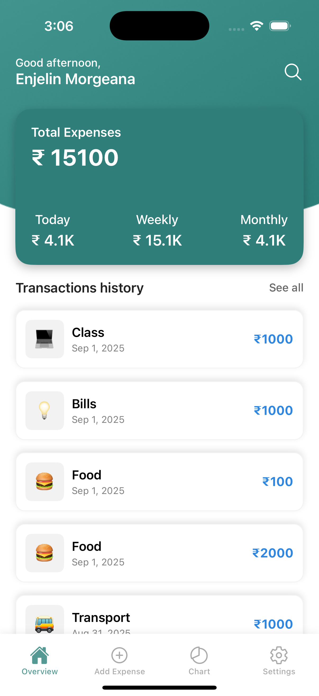
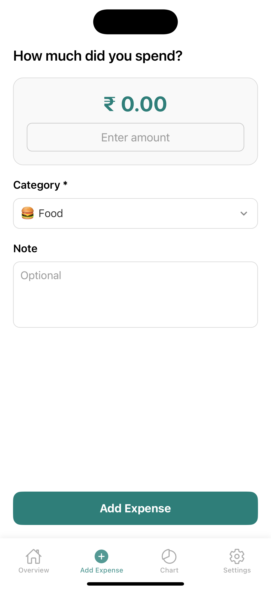
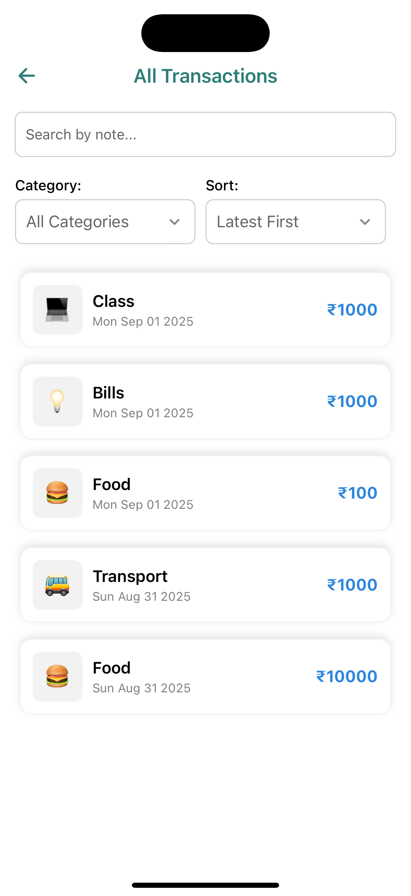
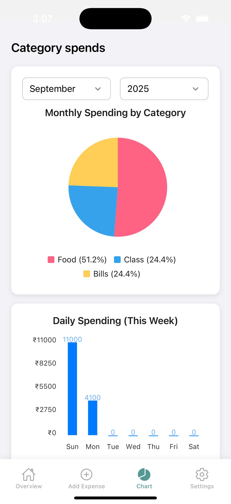
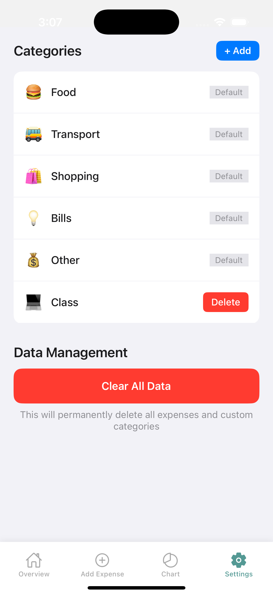
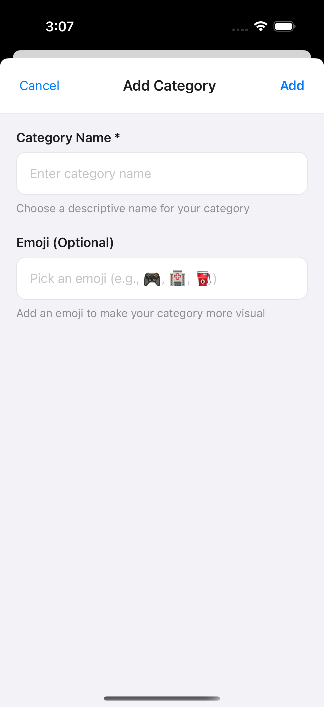
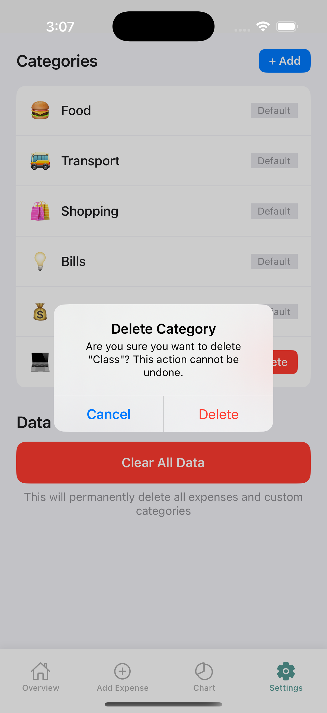

<p align="center">
  
</p>

<h1 align="center">📊 FinanceTracker</h1>
<p align="center">A simple and efficient React Native app to track your daily expenses and manage personal finances.</p>

---

# 📊 FinanceTracker

A simple and efficient **React Native app** to track your daily expenses and manage personal finances.  
Built with a clean folder structure for scalability and maintainability.

---

## 🚀 Features

- Add, edit, and delete expenses 💸
- Group expenses by **categories** (Food, Transport, Shopping, etc.)
- View **date-wise expense summaries** 📅
- Track monthly and daily spending trends 📈
- Organized and clean **UI with reusable components**
- Persistent data storage using **Async storage** ⚡
- Smooth navigation between screens using React Navigation

### 📱 Screens

- **Home Screen** → Displays all expenses with category-wise breakdown
- **Add Expense Screen** → Add new expenses with amount, category, and date
- **Expense Summary Screen** → View total and category-based summaries
- **Chart Screen** → Insights into daily/monthly expenses
- **Settings Screen** → Manage categories and preferences

---

## 📂 Folder Structure

- FinanceTracker/
- │
- ├─- src/
- │ ├── assets/ # Includes assets such as png and svg
- │ ├── components/ # Reusable UI components (e.g., cards)
- │ ├── screens/ # App screens (Home, AddExpense, Reports, Settings, etc.)
- │ ├── navigtion/ # Contain app navigation with react navigation
- │ ├── utils/ # Utility functions (date formatting, calculations, etc.)
- │ ├── storage/ # Async storage setup & helper functions
- │ └── App.tsx # Main app entry point
- │
- ├── android/ # Native Android project files
- ├── ios/ # Native iOS project files
- ├── package.json # Project metadata & dependencies
- └── README.md # Project documentation

---

## 📱 Screenshots

<p align="center">
  
  
  
  
  
  
  
  
</p>

---

## 🛠️ Setup Instructions

### Prerequisites

- Node.js (LTS version recommended)
- React Native CLI environment setup (Xcode for iOS, Android Studio for Android)
- Yarn or npm as package manager

### Installation

1. Clone the repository:
   ```bash
   git clone https://github.com/Bishaltureha/FinanceTracker.git
   cd FinanceTracker
   ```

### Install dependencies:

yarn install

# or

npm install

### Run the app:

Android:

yarn android

iOS:

cd ios && pod install && cd ..

yarn ios
